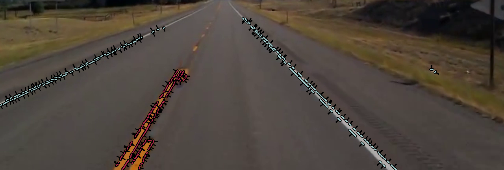

# Traditional Lane Detector
Python implementation of a traditional lane 
detector based on the lane detection pipeline 
proposed in the paper ["Duckietown: an Open, Inexpensive and Flexible
Platform for Autonomy Education and Research"](https://ieeexplore.ieee.org/document/7989179).

# Requirements
* **Python**
* **OpenCV** and OpenCV prerequisites.

Currently working with Python 3.10.5 and OpenCV 4.6.0.

# Installation
The installation process varies depending on your
computer architecture and if you want to use OpenCV 
with gpu acceleration from CUDA.

## Desktop computer or laptop with conda (CPU only)
a. Install conda following the instructions [here](https://conda.io/projects/conda/en/latest/user-guide/install/index.html)

b. Import the conda environment and activate it
```shell
conda conda env create -n TLD --file environmet.yml
conda activate TLD
```

c. Clone the repository
```shell
git clone https://github.com/Ign-Es/TraditionalLaneDetector.git
cd TraditionalLaneDetector
```
## ARM architecture computer with archiconda (CPU only)
a. Install archiconda following the instructions [here](https://github.com/yqlbu/archiconda3)

b. Import the conda environment and activate it
```shell
conda conda env create -n TLD --file environmet.yml
conda activate TLD
```

c. Clone the repository
```shell
git clone https://github.com/Ign-Es/TraditionalLaneDetector.git
cd TraditionalLaneDetector
```
# Get Started
The "examples" directory includes to simple examples
of how to use the functions included in "tld.py".
To use the traditional lane detector with a
webcam, run:
```shell
python cam_detection.py
```
## Camera selection
If you have multiple cameras connected, you can
select which one to use by modifying the "number"
inside cv2.VideoCapture(number) in line 16:
```python
cap = cv2.VideoCapture(0)
```
## Color selection
The algorithm detects white, yellow and red borders
by default, if you want to remove or add diferent
colors you may add code creating a dictionary with
lower and upper HSV threshold values and add it 
to the "colors" dictionary in line 9, such as:
```python
blue_range = {'low': [110,50,50], 'high': [130,255,255]}
colors = {"blue": blue_range, "red": red_range, "yellow": yellow_range, "white": white_range}
```

